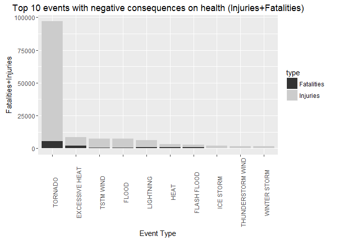
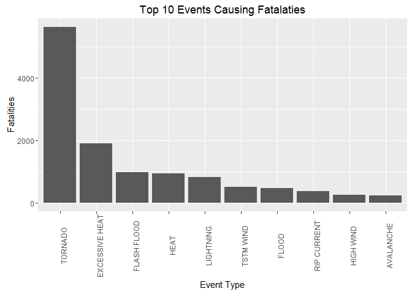
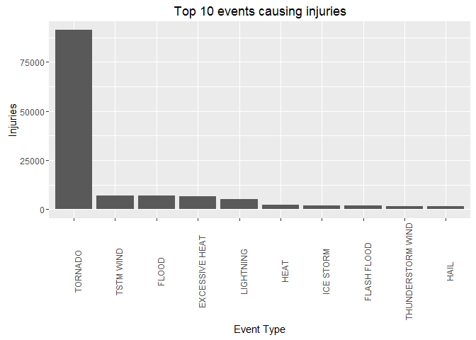
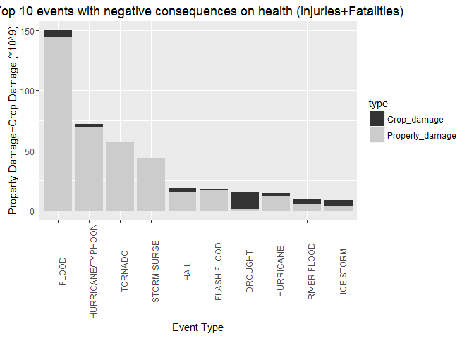
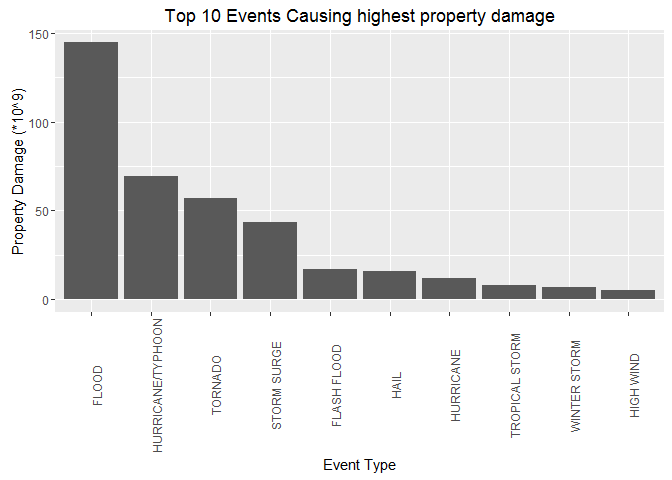
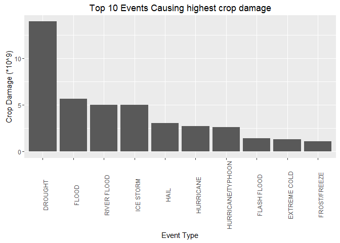

# Analysis of US Weather and The Effects of Major Events on Population Health and Economic Status

###Synopsis
This project involves exploring the U.S. National Oceanic and Atmospheric Administration's (NOAA) storm database. It mainly looks into the types of events that are most harmful with respect to population health (i.e. fatalities and injuries). In addition, it highlights the events affecting properties and crops resulting in severe economic consequences. The reported results indicate the top-ten events with negative consequences in each case and provide plots to show the calculated values. The most harmful events are also listed separately and cumulatively in tables, whether in the case of health or economic consequences.

###Data Processing 


```r
#calling libraries
setwd("G:/MOOC_Courses/Data Science Toolbox/5-Reproducible Research/Week4/Assign2/Weather_Analysis_Consequences")
library(dplyr)
library(ggplot2)
library(tidyr)
```

####-Downloading and reading data


```r
#download and unzip data
data_url<-"https://d396qusza40orc.cloudfront.net/repdata%2Fdata%2FStormData.csv.bz2"

if(!file.exists("weather.csv.bz2")) 
{download.file(data_url, destfile = "weather.csv.bz2")}

#read data
storm_data<-read.csv("weather.csv.bz2",header = T, stringsAsFactors = F)
```

####-Reading and editing the data


```r
#create a lookup table

lut<-c("0"=0,"1"=1,"2"=2,"3"=3,"4"=4,"5"=5,"6"=6,"7"=7,"8"=8,"h"=2,"H"=2,"K"=3,"m"=6,"M"=6,"B"=9)
# 
# #replace the values in PROPDMGEXP & CROPDMGEXP columns with the corresponding values in the lookup table
storm_data$PROPDMGEXP<-(lut[storm_data$PROPDMGEXP])
storm_data$CROPDMGEXP<-(lut[storm_data$CROPDMGEXP])
```
###Results

####-Types of events that are most harmful with respect to population health

The following results and plots show that tornados are the worst effects in terms of negative consequences on health as they cause thousands of injuries and fatalities. Excessive heat, TSTM Wind and floods come next if we look on their cumulative effect. However their severity differs with respect to injuries and fatalities. And it is clear that the number of injuries dominates when both injuries and fatalities are summed up.


```r
#calculate the number of fatalities and injuries corresponding to each event type
E1<-storm_data %>%
        select(EVTYPE,FATALITIES, INJURIES) %>%
        group_by(EVTYPE) %>%
        summarise(Fatalities=sum(FATALITIES),Injuries=sum(INJURIES)) %>%
        mutate(Total=(Fatalities+Injuries))

#order the events based on the cumulative effect (fatalities+injuries)
E1t<-E1[order(E1$Total,decreasing = T),]

#Extract and order the top events corresponding to fatalities
E1f<-select(E1,EVTYPE,Fatalities)[order(E1$Fatalities,decreasing = T),]

#Extract and order the top corresponding to injuries
E1i<-select(E1,EVTYPE,Injuries)[order(E1$Injuries,decreasing = T),]
```

-Top tep ten events causing the most fatalities+injuries cumulatively:

```
## Source: local data frame [10 x 4]
## 
##               EVTYPE Fatalities Injuries Total
##                (chr)      (dbl)    (dbl) (dbl)
## 1            TORNADO       5633    91346 96979
## 2     EXCESSIVE HEAT       1903     6525  8428
## 3          TSTM WIND        504     6957  7461
## 4              FLOOD        470     6789  7259
## 5          LIGHTNING        816     5230  6046
## 6               HEAT        937     2100  3037
## 7        FLASH FLOOD        978     1777  2755
## 8          ICE STORM         89     1975  2064
## 9  THUNDERSTORM WIND        133     1488  1621
## 10      WINTER STORM        206     1321  1527
```
-Top tep ten events causing the most fatalities:

```
## Source: local data frame [10 x 2]
## 
##            EVTYPE Fatalities
##             (chr)      (dbl)
## 1         TORNADO       5633
## 2  EXCESSIVE HEAT       1903
## 3     FLASH FLOOD        978
## 4            HEAT        937
## 5       LIGHTNING        816
## 6       TSTM WIND        504
## 7           FLOOD        470
## 8     RIP CURRENT        368
## 9       HIGH WIND        248
## 10      AVALANCHE        224
```
-Top tep ten events causing the most injuries:

```
## Source: local data frame [10 x 2]
## 
##               EVTYPE Injuries
##                (chr)    (dbl)
## 1            TORNADO    91346
## 2          TSTM WIND     6957
## 3              FLOOD     6789
## 4     EXCESSIVE HEAT     6525
## 5          LIGHTNING     5230
## 6               HEAT     2100
## 7          ICE STORM     1975
## 8        FLASH FLOOD     1777
## 9  THUNDERSTORM WIND     1488
## 10              HAIL     1361
```

####Plotting data events that are most harmful with respect to population health

```r
#fatalities Vs. events
pf<-ggplot(data=head(E1f,10),aes(x=reorder(EVTYPE,-Fatalities) ,y=Fatalities))+
        geom_bar(stat="identity")+
        scale_x_discrete(name="Event Type")+
        scale_y_continuous(name="Fatalities")+
        labs(title="Top 10 Events Causing Fatalaties")+
        theme(axis.text.x=element_text(angle = 90,vjust=1))

#Injuries Vs. events
pi<-ggplot(data=head(E1i,10),aes(x=reorder(EVTYPE,-Injuries) ,y=Injuries))+
        geom_bar(stat="identity")+
        scale_x_discrete(name="Event Type")+
        scale_y_continuous(name="Injuries")+
        labs(title="Top 10 events causing injuries")+
        theme(axis.text.x=element_text(angle = 90,vjust=1))

#gather data to use fatalities/injuries for coloring the bars
kk<-gather(head(E1t,10), value="Total_by_Type",key="type",Fatalities,Injuries,na.rm = T)

#Fatalities+Injuries Vs. events
pp1<-ggplot(data=kk,aes(x=reorder(EVTYPE,-Total_by_Type),y=Total_by_Type,fill=type))+
        geom_bar(stat="identity")+
        scale_x_discrete(name="Event Type")+
        scale_y_continuous(name="Fatalities+Injuries")+
        labs(title="Top 10 events with negative consequences on health (Injuries+Fatalities)")+
        theme(axis.text.x=element_text(angle = 90,vjust=1))+
        scale_fill_grey()
```

\

\

\


####-Types of events that have the greatest economic consequences

The following results and plots show that floods cause the highest losses in terms of properties, then comes the hurricanes/typhoons, tornadoes and storm surges. On the other hand droughts cause the highest crop damages, then comes the floods, river floods and ice storms. The results also indicate that the economic losses due to property damages are higher than the losses due to crop damages. Consuquently property damages' losses dominate the sum of both losses for most of the top ten cumulative losses.


```r
#calculate the number property and crop damage corresponding to each event type
E2<-storm_data %>%
        select(EVTYPE,PROPDMG,PROPDMGEXP, CROPDMG,CROPDMGEXP) %>%
        group_by(EVTYPE) %>%
        summarise(Property_damage=sum(PROPDMG*10^PROPDMGEXP,na.rm=T),
                Crop_damage=sum(CROPDMG*10^CROPDMGEXP,na.rm=T)) %>%
        mutate(Total_Dmg=Property_damage+Crop_damage)

#order the events based on the cumulative effect (property damage+crop damage)
E2t<-E2[order(E2$Total_Dmg,decreasing=T),]

#Extract and order the top events corresponding to property damage
E2p<-select(E2,EVTYPE,Property_damage)[order(E2$Property_damage,decreasing = T),]

#Extract and order the top events corresponding to crop damage
E2c<-select(E2,EVTYPE,Crop_damage)[order(E2$Crop_damage,decreasing = T),]
```


-Top tep ten events causing the highest economic losses cumulatively (property damage+crop damage):

```
## Source: local data frame [10 x 4]
## 
##               EVTYPE Property_damage Crop_damage    Total_Dmg
##                (chr)           (dbl)       (dbl)        (dbl)
## 1              FLOOD    144657709800  5661968450 150319678250
## 2  HURRICANE/TYPHOON     69305840000  2607872800  71913712800
## 3            TORNADO     56947380614   414953270  57362333884
## 4        STORM SURGE     43323536000        5000  43323541000
## 5               HAIL     15735267456  3025537470  18760804926
## 6        FLASH FLOOD     16822673772  1421317100  18243990872
## 7            DROUGHT      1046106000 13972566000  15018672000
## 8          HURRICANE     11868319010  2741910000  14610229010
## 9        RIVER FLOOD      5118945500  5029459000  10148404500
## 10         ICE STORM      3944927860  5022113500   8967041360
```
-Top tep ten events causing the higest property damages:

```
## Source: local data frame [10 x 2]
## 
##               EVTYPE Property_damage
##                (chr)           (dbl)
## 1              FLOOD    144657709800
## 2  HURRICANE/TYPHOON     69305840000
## 3            TORNADO     56947380614
## 4        STORM SURGE     43323536000
## 5        FLASH FLOOD     16822673772
## 6               HAIL     15735267456
## 7          HURRICANE     11868319010
## 8     TROPICAL STORM      7703890550
## 9       WINTER STORM      6688497251
## 10         HIGH WIND      5270046260
```
-Top tep ten events causing the higest crop damages:

```
## Source: local data frame [10 x 2]
## 
##               EVTYPE Crop_damage
##                (chr)       (dbl)
## 1            DROUGHT 13972566000
## 2              FLOOD  5661968450
## 3        RIVER FLOOD  5029459000
## 4          ICE STORM  5022113500
## 5               HAIL  3025537470
## 6          HURRICANE  2741910000
## 7  HURRICANE/TYPHOON  2607872800
## 8        FLASH FLOOD  1421317100
## 9       EXTREME COLD  1292973000
## 10      FROST/FREEZE  1094086000
```

####Plotting events that have the greatest economic consequences


```r
#Property Damage Vs. events
ppd<-ggplot(data=head(E2p,10),aes(x=reorder(EVTYPE,-Property_damage) ,y=Property_damage/10^9))+
        geom_bar(stat="identity")+
        scale_x_discrete(name="Event Type")+
        scale_y_continuous(name="Property Damage (*10^9)")+
        labs(title="Top 10 Events Causing highest property damage")+
        theme(axis.text.x=element_text(angle = 90,vjust=1))

#Crop Damage Vs.events
pcd<-ggplot(data=head(E2c,10),aes(x=reorder(EVTYPE,-Crop_damage) ,y=Crop_damage/10^9))+
        geom_bar(stat="identity")+
        scale_x_discrete(name="Event Type")+
        scale_y_continuous(name="Crop Damage (*10^9)")+
        labs(title="Top 10 Events Causing highest crop damage")+
        theme(axis.text.x=element_text(angle = 90,vjust=1))

#gather data to use Property_damage,Crop_damage for coloring the bars
mm<-gather(head(E2t,10), value="Total_by_Type",key="type",Property_damage,Crop_damage,na.rm = T)

#Property Damage+Crop Damage Vs. events
pp2<-ggplot(data=mm,aes(x=reorder(EVTYPE,-Total_by_Type),y=Total_by_Type/10^9,fill=type))+
        geom_bar(stat="identity")+
        scale_x_discrete(name="Event Type")+
        scale_y_continuous(name="Property Damage+Crop Damage (*10^9)")+
        labs(title="Top 10 events with negative consequences on health (Injuries+Fatalities)")+
        theme(axis.text.x=element_text(angle = 90,vjust=1))+
        scale_fill_grey()
```

\

\

\

In conclusion, the weather events thet cause th highest public health and economic problems for communities and municipalities could be highlighted and the losses were reported per event. This could be used to allocate resources for proactive actions in order to reduce the losses whenever possible. 
